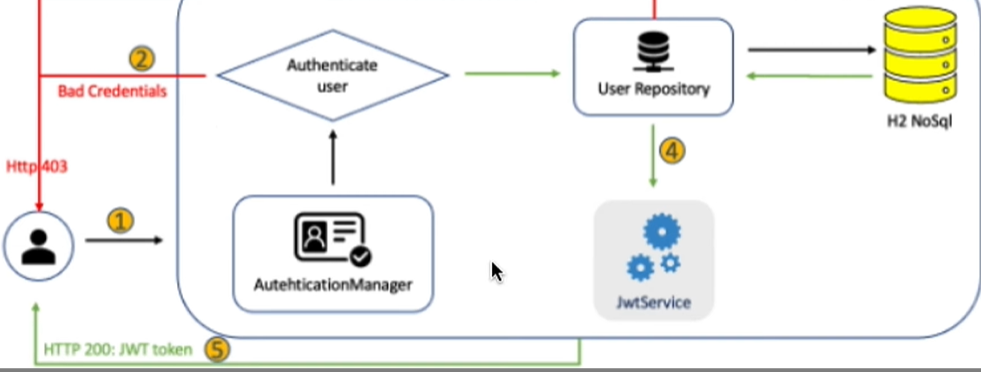
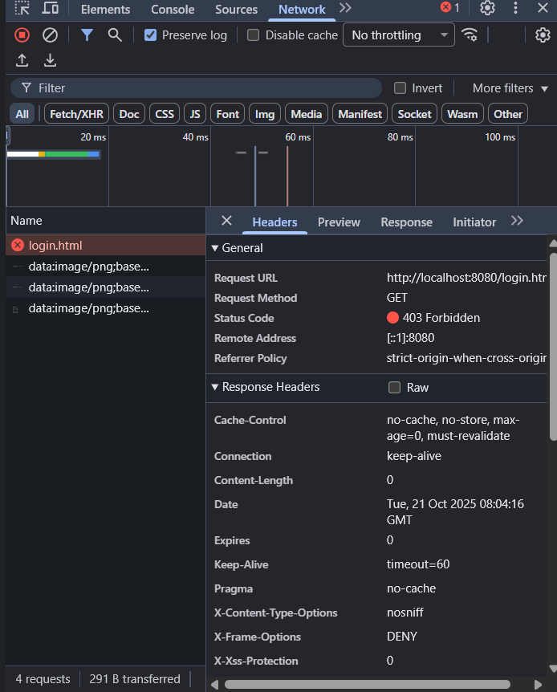
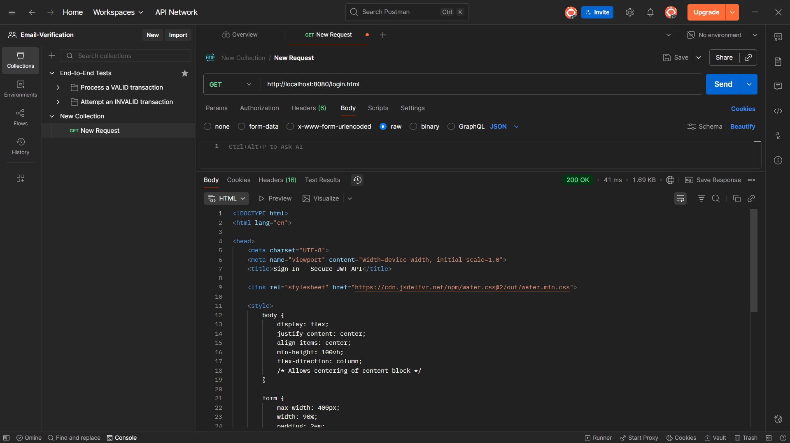
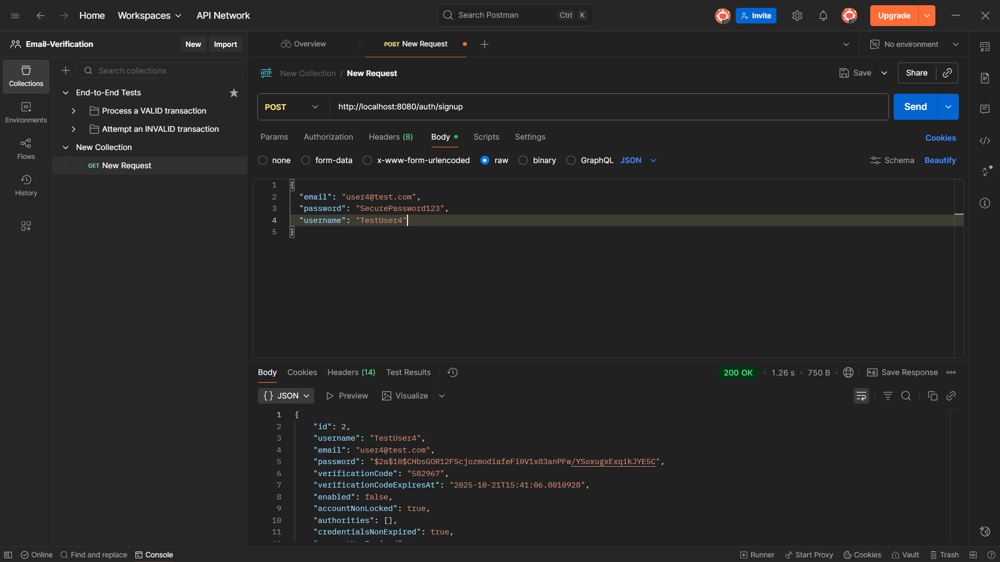
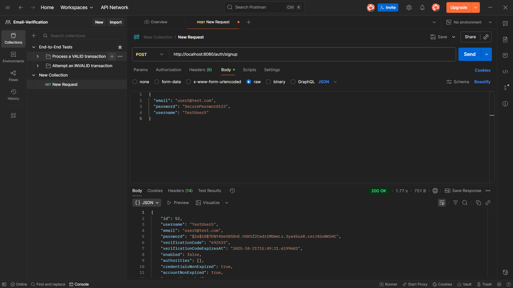

# Email-Verification
This project delivers a robust, stateless backend API built with Spring Boot, secured using Spring Security and JSON Web Tokens (JWT). It provides core authentication features (signup/register, signin/login) and serves as a secure foundation for any modern full-stack application.

