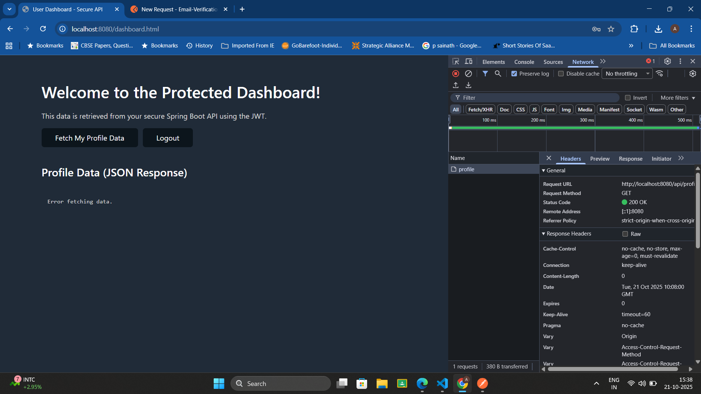

# Email-Verification
This project delivers a robust, stateless backend API built with Spring Boot, secured using Spring Security and JSON Web Tokens (JWT). It provides core authentication features (signup/register, signin/login) and serves as a secure foundation for any modern full-stack application.
 Deployed using Elastic Load Balancer on AWS:
 http://spring-jwt-env.eba-wej5cii3.ap-south-1.elasticbeanstalk.com/login.html
 

